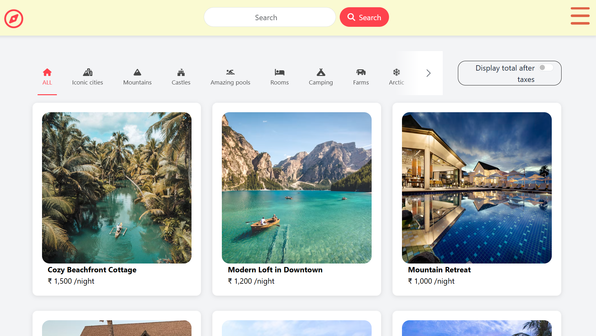

# 🏡 StaySphere - Vacation Rental Marketplace



**StaySphere** is a full-stack vacation rental marketplace web application (Airbnb alternative) built with Node.js, Express, MongoDB, EJS, and Bootstrap. It supports full listing management, dynamic image uploads with Cloudinary, interactive geolocation maps with Mapbox, review & rating systems, category filtering, and robust user authentication.

---

## ✨ Features

- 🔐 **User Authentication & Authorization**: Secure signup, login, and session persistence using Passport.js. Permissions prevent unauthorized edits/deletions.
- 🏡 **Listing CRUD Operations**: Create, browse, edit, and delete accommodation listings with detailed pricing, descriptions, and location data.
- 📸 **Cloud Image Uploads**: Seamless image upload handling with Multer and Cloudinary cloud storage.
- 🗺️ **Interactive Geolocation & Maps**: Automatic forward geocoding and interactive Mapbox map displays with pulsing markers.
- ⭐ **Reviews & Rating System**: Star ratings and user feedback powered by Starability CSS.
- 🔍 **Search & Category Filters**: Real-time filtering by category (Rooms, Iconic cities, Mountains, Castles, Pools, Camping, Farms, Arctic, Domes, Boats) and text/price search.
- 📱 **Responsive UI**: Sleek mobile-first design with Bootstrap 5 and custom CSS.
- 🚀 **Deployment Ready**: Fully configured for deployment on **Vercel** or **Render**.

---

## 🛠️ Tech Stack

- **Backend**: Node.js, Express.js
- **Database**: MongoDB, Mongoose ODM
- **Frontend / Templating**: EJS, EJS-Mate, Bootstrap 5, FontAwesome
- **Authentication**: Passport.js, Passport-Local, Passport-Local-Mongoose
- **Cloud Storage**: Cloudinary, Multer, Multer-Storage-Cloudinary
- **Maps & Geocoding**: Mapbox GL JS, Mapbox SDK
- **Session & Storage**: Express-Session, Connect-Mongo, Connect-Flash
- **Validation**: Joi schema validation

---

## 🚀 Getting Started Locally

### 1. Prerequisites
- [Node.js](https://nodejs.org/) (v18 or higher)
- [MongoDB](https://www.mongodb.com/) (Local or MongoDB Atlas cluster)
- [Cloudinary Account](https://cloudinary.com/) (Free tier)
- [Mapbox Account](https://www.mapbox.com/) (Free public token)

### 2. Installation

Clone the repository and install dependencies:

```bash
git clone https://github.com/PREM-A261/StaySphere.git
cd StaySphere
npm install
```

### 3. Environment Variables Configuration

Create a `.env` file in the root directory (refer to `.env.example`):

```env
# MongoDB Connection URL (Local or Atlas)
ATLASDB_URL=mongodb://127.0.0.1:27017/staysphere

# Express Session Secret
SECRET=your_secret_session_key

# Cloudinary Credentials
CLOUD_NAME=your_cloudinary_cloud_name
CLOUD_API_KEY=your_cloudinary_api_key
CLOUD_API_SECRET=your_cloudinary_api_secret

# Mapbox Token
MAP_TOKEN=your_mapbox_public_token

# Server Port (optional)
PORT=8080
```

### 4. (Optional) Seed Database

To populate your database with sample listings:

```bash
npm run seed
```

### 5. Start the Application

```bash
npm start
```

Open [http://localhost:8080](http://localhost:8080) in your browser.

---

## 🌐 Deployment Guide

### Option A: Deploy to Vercel

1. Push this repository to your GitHub account.
2. Sign in to [Vercel](https://vercel.com) and click **Add New Project**.
3. Import your `StaySphere` repository.
4. Add the following **Environment Variables** in the Vercel project settings:
   - `ATLASDB_URL`: Your MongoDB Atlas connection string
   - `SECRET`: Random secret string
   - `CLOUD_NAME`: Cloudinary cloud name
   - `CLOUD_API_KEY`: Cloudinary API key
   - `CLOUD_API_SECRET`: Cloudinary API secret
   - `MAP_TOKEN`: Mapbox public access token
5. Click **Deploy**. Vercel uses `vercel.json` to deploy the application as a serverless function.

---

### Option B: Deploy to Render

1. Create a free account on [Render](https://render.com/).
2. Click **New +** -> **Web Service**.
3. Connect your GitHub repository `StaySphere`.
4. Configure the settings:
   - **Environment**: `Node`
   - **Build Command**: `npm install`
   - **Start Command**: `node app.js`
5. Under **Environment Variables**, add:
   - `ATLASDB_URL`: MongoDB Atlas connection string
   - `SECRET`: Random secret string
   - `CLOUD_NAME`, `CLOUD_API_KEY`, `CLOUD_API_SECRET`
   - `MAP_TOKEN`
6. Click **Create Web Service**.

---

## 📂 Project Structure

```
StaySphere/
├── controllers/       # MVC Controllers (listings, reviews, users)
├── models/            # Mongoose Schemas (listing, review, user)
├── routes/            # Express Routes (listing, review, user, static)
├── views/             # EJS Templates & Layouts
│   ├── includes/      # Navbar, footer, flash alerts
│   ├── layouts/       # Boilerplate layout
│   ├── listings/      # Listing views (index, show, new, edit)
│   └── users/         # Authentication views (login, signup)
├── public/            # Static assets (CSS, JS, Icons)
├── utils/             # ExpressError, wrapAsync helper
├── init/              # Seed data and initialization scripts
├── cloudConfig.js     # Cloudinary and Multer configuration
├── middleware.js      # Authentication and validation middlewares
├── schema.js          # Joi validation schemas
├── app.js             # Main application entry point
├── vercel.json        # Vercel serverless deployment config
└── README.md
```

---

## 📄 License
This project is licensed under the ISC License.
